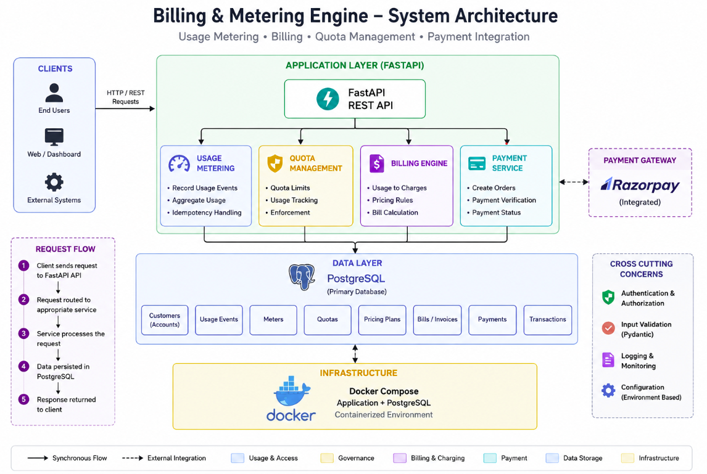
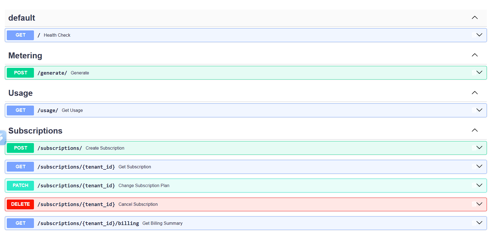
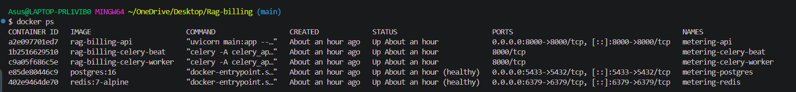
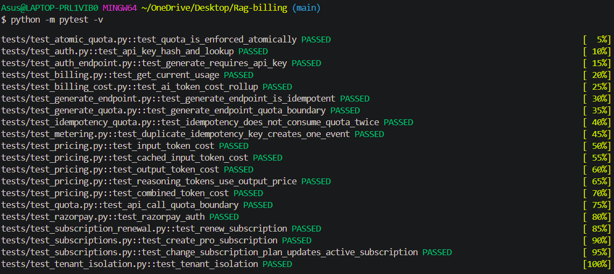

# Billing & Metering Engine

A production-oriented **usage metering and billing backend** built with **Python, FastAPI, PostgreSQL, SQLAlchemy, Alembic, Pytest, and Docker**.

The system is designed for SaaS and API-based applications where customers are charged according to their resource consumption. It provides the core backend infrastructure required to record usage, calculate charges, enforce quotas, and integrate with a payment provider.

---

## 📸 Project Overview



---

## ✨ Features

* **Usage Metering** — Record and track customer resource consumption
* **Usage-Based Billing** — Convert measured usage into billable amounts
* **Quota Management** — Track usage against configured limits
* **REST API** — FastAPI-based backend with automatic API documentation
* **PostgreSQL** — Persistent relational storage
* **SQLAlchemy** — Database ORM
* **Alembic** — Database schema migrations
* **Automated Testing** — Pytest-based test suite
* **Dockerized Environment** — Application and database run through Docker Compose
* **Payment Gateway Abstraction** — Extensible payment integration with Razorpay support/foundation
* **Environment-Based Configuration** — Application configuration through environment variables

---

# 🏗 Architecture

The application follows a layered backend architecture that separates API handling, business logic, database operations, billing, and payment concerns.

```text
                    ┌─────────────────────┐
                    │       Client        │
                    └──────────┬──────────┘
                               │
                               ▼
                    ┌─────────────────────┐
                    │       FastAPI       │
                    │        API          │
                    └──────────┬──────────┘
                               │
                               ▼
                    ┌─────────────────────┐
                    │  Application Logic  │
                    └──────────┬──────────┘
                               │
                 ┌─────────────┴─────────────┐
                 │                           │
                 ▼                           ▼
       ┌───────────────────┐       ┌───────────────────┐
       │  Usage Metering   │       │      Billing      │
       └─────────┬─────────┘       └─────────┬─────────┘
                 │                           │
                 └─────────────┬─────────────┘
                               │
                               ▼
                    ┌─────────────────────┐
                    │     PostgreSQL      │
                    └──────────┬──────────┘
                               │
                               ▼
                    ┌─────────────────────┐
                    │   Payment Gateway   │
                    │      Adapter        │
                    └─────────────────────┘
```

---

# 🧠 Core Concepts

## Usage Metering

Metering is the process of recording how much of a service a customer consumes.

For example:

```text
Customer A

API Request → 1 unit
API Request → 1 unit
API Request → 1 unit
API Request → 1 unit

Total Usage = 4 units
```

Each usage event can be associated with a customer, resource/meter, quantity, timestamp, and event identifier.

Usage can then be aggregated over a billing period.

```text
Event 1 → 50 units
Event 2 → 100 units
Event 3 → 25 units

Total Usage → 175 units
```

---

# 💰 Billing

The billing layer converts metered usage into a monetary amount.

A simplified usage-based pricing model is:

```text
Billable Amount = Usage × Unit Price
```

Example:

```text
Usage      = 10,000 requests
Unit Price = ₹0.01

Amount     = ₹100
```

Separating billing logic from usage collection allows pricing rules to evolve without changing the core metering mechanism.

The architecture can support future pricing models such as:

* Per-unit pricing
* Tiered pricing
* Volume pricing
* Subscription + usage
* Minimum charges
* Credits and discounts

---

# 🚦 Quota Enforcement

Quotas allow the system to limit how much a customer can consume.

Example:

```text
Quota        = 10,000 units
Current Usage = 9,850 units
Remaining    = 150 units
```

If a request requires 200 additional units:

```text
Requested = 200
Remaining = 150

Result → Request rejected
```

Quota enforcement is important for:

* Preventing excessive resource consumption
* Controlling customer costs
* Protecting backend resources
* Enforcing plan limits

The architecture can be extended toward stronger atomic quota enforcement for concurrent requests.

---

# 🗄 Database

The project uses **PostgreSQL** as its primary relational database.

The database is responsible for persistent billing and metering data.

Conceptually:

```text
Customer / Account
        │
        ├── Usage Events
        │
        ├── Quotas
        │
        ├── Pricing / Plans
        │
        └── Billing Records
```

**SQLAlchemy** is used for database interaction and ORM-based data modeling.

**Alembic** is used to manage database schema migrations.

---

# 🌐 API

The backend is implemented using **FastAPI**.

FastAPI provides automatically generated interactive API documentation.

Once the application is running:

### Swagger UI

```text
http://localhost:8000/docs
```

### ReDoc

```text
http://localhost:8000/redoc
```

### OpenAPI Schema

```text
http://localhost:8000/openapi.json
```

## API Screenshot



The Swagger interface can be used to explore and test the available endpoints.

---

# 🐳 Docker

The application is containerized using **Docker** and **Docker Compose**.

The Dockerized environment allows the application and PostgreSQL database to run together in a reproducible development environment.

Start the complete environment:

```bash
docker compose up --build
```

Run in detached mode:

```bash
docker compose up -d --build
```

Check running containers:

```bash
docker compose ps
```

View logs:

```bash
docker compose logs -f
```

Stop the environment:

```bash
docker compose down
```

Stop the environment and remove database volumes:

```bash
docker compose down -v
```

> `docker compose down -v` removes persisted database data, so use it carefully.

## Docker Screenshot



---

# 🧪 Testing

The project includes an automated test suite using **Pytest**.

Run all tests:

```bash
pytest
```

Run tests with verbose output:

```bash
pytest -v
```

Run a specific test file:

```bash
pytest tests/<test_file>.py
```

The test suite covers functionality such as:

* API behavior
* Usage metering
* Billing calculations
* Database operations
* Validation
* Error handling
* Payment gateway components

## Test Results



---

# 🔄 Database Migrations

Alembic is used to manage database schema changes.

Create a migration:

```bash
alembic revision --autogenerate -m "describe change"
```

Apply migrations:

```bash
alembic upgrade head
```

Rollback the latest migration:

```bash
alembic downgrade -1
```

Check the current migration:

```bash
alembic current
```

View migration history:

```bash
alembic history
```

---

# 📁 Project Structure

```text
.
├── app/
│   ├── api/
│   ├── core/
│   ├── models/
│   ├── schemas/
│   ├── services/
│   ├── repositories/
│   └── main.py
│
├── alembic/
│   └── versions/
│
├── tests/
│
├── .dockerignore
├── .gitignore
├── Dockerfile
├── docker-compose.yml
├── alembic.ini
├── requirements.txt
├── .env.example
└── README.md
```

> The exact structure may differ depending on the modules currently present in the repository.

---

# 💳 Payment Gateway

The project uses a payment gateway abstraction to keep payment-provider-specific logic separate from the core billing system.

Conceptually:

```text
                 Billing System
                       │
                       ▼
             Payment Gateway Interface
                       │
              ┌────────┴────────┐
              ▼                 ▼
          Razorpay        Future Provider
```

This approach makes the billing engine less dependent on a single payment provider and allows additional providers to be introduced later.

The payment component is intentionally separated from the core metering and billing logic.

---

# 🔐 Security

Sensitive configuration is supplied through environment variables rather than hard-coded into the source code.

The following should never be committed:

```text
.env
API keys
Database passwords
Payment credentials
Private keys
Production secrets
```

The repository uses `.gitignore` and `.dockerignore` to prevent unnecessary or sensitive files from being included.

---

# ⚙️ Reliability Considerations

Billing infrastructure requires correctness because incorrect usage records can result in incorrect charges.

Important engineering considerations include:

## Idempotency

A usage event should not accidentally be processed multiple times.

```text
Usage Event
     │
     ▼
Event Identifier
     │
     ├── New Event
     │      ↓
     │   Process
     │
     └── Existing Event
            ↓
       Prevent Duplicate
```

## Transaction Safety

Related database operations should be performed transactionally where required to prevent partial updates and inconsistent billing state.

## Atomic Operations

Concurrent requests can create race conditions when updating usage and quota values.

Atomic operations become particularly important as the system scales and multiple requests attempt to modify the same customer's usage simultaneously.

## Auditability

Usage records should remain traceable so that billing decisions can be inspected and issues can be investigated.

---

# 📈 Scalability

The current architecture provides a foundation that can evolve toward higher-scale usage processing.

A future distributed architecture could look like:

```text
                  API Gateway
                       │
                       ▼
                 FastAPI API
                       │
                       ▼
               Usage Ingestion
                       │
                       ▼
                 Message Queue
                       │
             ┌─────────┴─────────┐
             ▼                   ▼
       Usage Workers       Billing Workers
             │                   │
             └─────────┬─────────┘
                       ▼
                  PostgreSQL
```

Potential future infrastructure improvements include:

* Background workers
* Message queues
* Redis
* Event-driven usage processing
* Batch usage aggregation
* Database partitioning
* Read replicas
* Horizontal API scaling
* Distributed rate limiting
* Observability and metrics

---

# 🎯 Engineering Goals

This project focuses on solving backend infrastructure problems rather than implementing a basic CRUD application.

The main engineering goals are:

1. **Reliable usage tracking**
2. **Correct billing calculations**
3. **Quota enforcement**
4. **Persistent and consistent billing data**
5. **Separation of business and infrastructure concerns**
6. **Containerized development**
7. **Automated testing**
8. **Extensible payment integration**
9. **Scalability toward high-volume usage processing**

---

# 📚 Learning Outcomes

Through this project, the following backend engineering concepts are demonstrated:

* Python backend development
* FastAPI
* REST API design
* PostgreSQL
* SQLAlchemy
* Alembic migrations
* Data modeling
* Transaction management
* Usage metering
* Usage-based billing
* Quota enforcement
* Idempotency
* Docker
* Docker Compose
* Automated testing
* Payment gateway abstraction
* Backend reliability
* Scalability considerations

---

# 📊 Technology Stack

| Technology     | Role                        |
| -------------- | --------------------------- |
| Python         | Backend language            |
| FastAPI        | REST API framework          |
| PostgreSQL     | Database                    |
| SQLAlchemy     | ORM                         |
| Alembic        | Database migrations         |
| Pydantic       | Data validation             |
| Pytest         | Testing                     |
| Docker         | Containerization            |
| Docker Compose | Multi-container development |
| Redis          | Message Broker              |
| Celery         | Background work             |
| Razorpay       | Payment gateway foundation  |

---

# 📝 Project Status

### Completed

* [x] FastAPI backend
* [x] PostgreSQL integration
* [x] SQLAlchemy ORM
* [x] Alembic migrations
* [x] Usage metering
* [x] Billing functionality
* [x] Quota functionality
* [x] Automated tests
* [x] Dockerfile
* [x] Docker Compose setup
* [x] Payment gateway abstraction
* [x] Razorpay gateway component
* [x] Background usage processing
* [x] Redis/message queue integration

---

# ⭐ Final Notes

**Billing & Metering Engine** demonstrates the core backend infrastructure required by usage-based SaaS and API products.

The project combines:

```text
FastAPI
   +
PostgreSQL
   +
SQLAlchemy
   +
Alembic
   +
Usage Metering
   +
Billing
   +
Quota Enforcement
   +
Docker
   +
Automated Testing
   +
Payment Gateway Abstraction
```

It provides a foundation that can be extended toward production-grade billing infrastructure for **SaaS platforms, API products, AI applications, and other usage-based services**.


